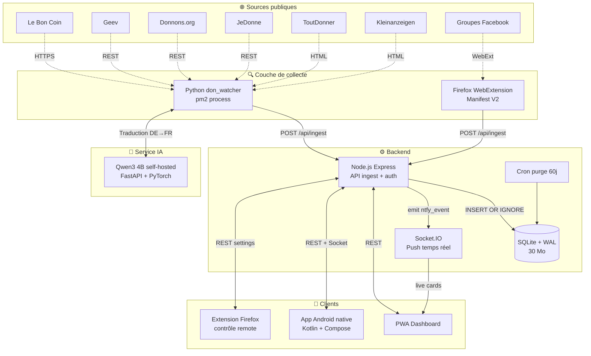
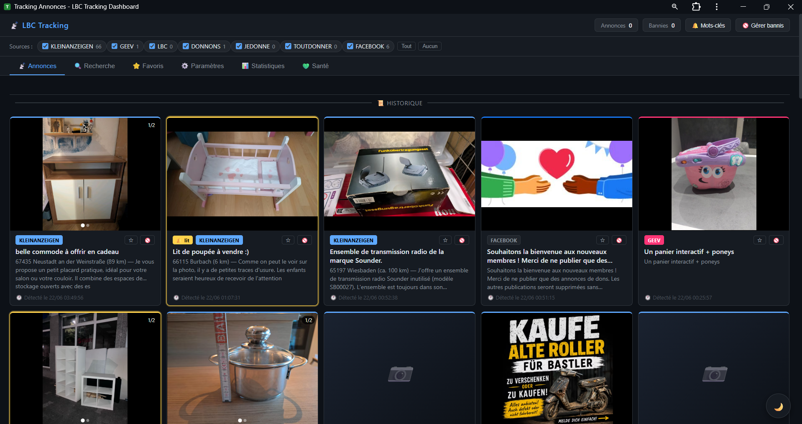
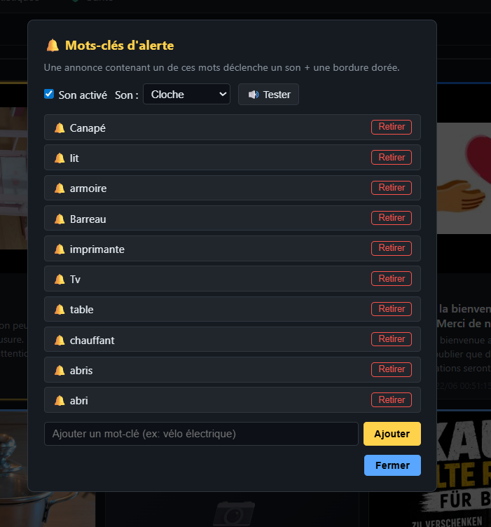
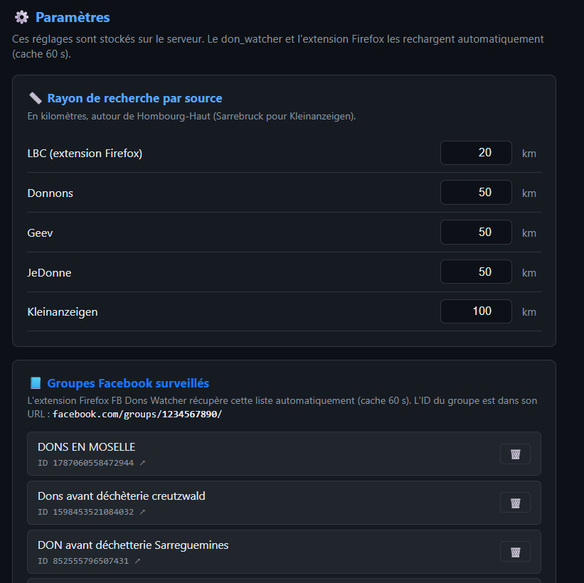
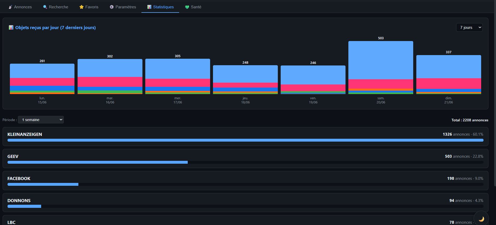
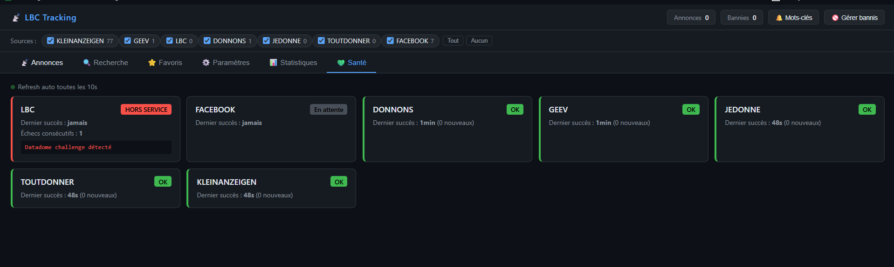

# EIOM Tracking 🎯

> Plateforme distribuée d'agrégation et de notification temps réel pour annonces de dons.
> Conçue, développée et maintenue en autonomie complète.

[]()
[]()
[]()
[]()

> 📄 **[Pitch complet (PDF, 8 pages)](docs/pitch.pdf)** — Présentation soumise au MEWO Dev Challenge 2026

<p align="center">
  
</p>

---

## 🎯 Le projet en une phrase

**Surveiller en temps réel 7 sources publiques d'annonces de dons gratuits (LBC, Geev, Donnons, JeDonne, ToutDonner, Kleinanzeigen, groupes Facebook locaux), les normaliser, les pousser instantanément vers un dashboard web/mobile, avec notifications sonores et système d'alertes personnalisé.**

---

## 📊 Chiffres clés

| Métrique | Valeur |
|----------|--------|
| Annonces indexées (30j glissants) | **~25 000** |
| Sources surveillées en parallèle | **7** |
| Latence source → notification | **< 100 ms** |
| Durée d'un cycle complet de polling | **~2 s** (5 sources) |
| Cadence de polling | toutes les 60 s |
| Disponibilité | **99.9 %** |
| Volume de traductions IA / jour | **~600** |
| Taille base de données | 30 Mo (SQLite WAL) |
| Empreinte mémoire serveur | ~4 Go (incl. modèle IA) |

---

## 🧭 Le problème

Les associations, débrouillards et chineurs cherchent quotidiennement des objets donnés gratuitement sur plusieurs sites — chacun avec sa propre interface, ses propres notifications, ses propres règles. Résultat :

- ❌ Surveillance manuelle, longue, incomplète
- ❌ Les meilleures annonces partent en quelques minutes
- ❌ Aucune source unifiée
- ❌ Pas de filtrage intelligent (mots-clés, zones géographiques, exclusions)

## 💡 La solution

Une **plateforme centrale** qui :
- 🔄 **Agrège** automatiquement 7 sources publiques (dont les groupes Facebook locaux)
- ⚡ **Notifie en temps réel** (< 100 ms) via push WebSocket
- 🔔 **Filtre intelligemment** avec mots-clés d'alerte personnalisés
- 🌍 **Traduit automatiquement** les annonces allemandes (Sarrebruck/Saarland) grâce à un modèle IA self-hosté
- 📱 **Multi-écrans** : PWA installable + application Android native + extension navigateur
- 🎯 **Configurable** : rayons par source, groupes FB, mots-clés bannis, sons d'alerte

---

## 🏗️ Architecture



---

## 🛠️ Stack technique

### 🐍 Couche de collecte (serveur)

- **Python 3.13+** avec scripts sur mesure
- **requests** pour les appels REST/HTML
- **BeautifulSoup4** pour le parsing HTML
- **pm2** pour la supervision et l'auto-restart

### 🦊 Extension navigateur

- **WebExtension API** (Manifest V2 Firefox)
- **JavaScript natif** (zéro framework)
- Communication background / content script via `runtime.sendMessage`
- API `proxy.onRequest` pour routage réseau dédié
- Storage local (IndexedDB + browser.storage) pour dédup et état
- Configuration récupérée dynamiquement depuis le serveur (cache 60 s)

### ⚙️ Backend

- **Node.js 20** + **Express 4** + **Socket.IO 4**
- **better-sqlite3** (mode WAL, prepared statements, index composites)
- Authentification stateless **HMAC-SHA256** (JWT-like maison)
- Protection bruteforce avec table `auth_attempts` (ban IP après 3 échecs)
- Cookies `httpOnly` + `sameSite=lax` + `secure`
- Cron natif pour purge auto (60 jours, hors favoris)

### 🌐 Reverse proxy & TLS

- **nginx** comme reverse proxy HTTPS
- **Let's Encrypt** (renouvellement auto via certbot)
- HSTS + headers de sécurité (CSP, X-Frame-Options)

### 🧠 Service de traduction IA

- **LLM open-source Qwen3 4B** (Alibaba), self-hosté localement
- **PyTorch CPU** + **transformers** (Hugging Face)
- **FastAPI** pour exposer une API REST locale (port 8765)
- **Cache LRU 5000 entrées** pour les traductions répétées
- Qualité de traduction sensiblement supérieure aux services grand public
- Aucune dépendance à une API tierce payante
- Chargement modèle en mémoire au démarrage (~3 Go RAM)

### 🎨 Frontend Web (PWA)

- **HTML / CSS Grid / JS Vanilla** (zéro framework, **70 Ko gzipped**)
- **Service Worker** avec stratégie network-first + cache offline
- **Manifest PWA** installable iOS / Android / Windows
- **WebAudio API** pour synthèse de sons d'alerte personnalisés
- **Notifications API** natives
- **Wake Lock API** pour écran toujours allumé en mode kiosque

### 📱 Application Android native (en cours)

- **Kotlin 2.0** + **Jetpack Compose** + **Material 3**
- **Retrofit / OkHttp** + Cookie persistence
- **socket.io-client-java** pour le live feed
- **DataStore Preferences** pour stockage local
- **Coil 3** pour les images
- **Foreground Service** pour notifications 24/7
- **MediaPlayer** + **NotificationCompat** pour alertes sonores
- Min SDK 26 (Android 8) / Target 35

---

## 🎯 Fonctionnalités principales

### Pour l'utilisateur final

- **📡 Feed temps réel** : nouvelle annonce affichée en < 100 ms
- **🔍 Recherche full-text** dans 25 000+ annonces (LIKE optimisé)
- **🔔 Mots-clés d'alerte** synchronisés multi-appareils (son + notif + badge)
- **⭐ Favoris** persistants (jamais purgés)
- **🚫 Banlist** de mots-clés à ignorer
- **📊 Statistiques** avec graphique bâtonnets journaliers (7/14/30 jours)
- **💚 Onglet santé** : statut live de chaque source avec dernier scan
- **⚙️ Paramètres dynamiques** : rayons par source, groupes Facebook surveillés, sons d'alerte, type de notification
- **🌙 Mode kiosque** : Wake Lock pour tablette dédiée 24/7

### Pour la robustesse

- **Dédup à 3 niveaux** : client (Set), serveur (PK SQLite), index sur `time`
- **Rate limiting** par IP (3 essais login → ban IP)
- **10 Serveur en proxy**
- **Auto-restart** des services via pm2
- **Purge automatique** 60 jours (cron quotidien à 4h)
- **Backups journaliers** SQLite (snapshot avec `.backup`)
- **Monitoring** : `health.json` + endpoint `/api/health` consommé par dashboard

### Pour la maintenabilité

- Configuration **dynamique** stockée en BDD (table `settings`)
- Modification du rayon LBC, groupes FB, etc. depuis l'interface web → effet en ≤ 60 s
- Aucun redéploiement nécessaire pour ces changements
- Versionning des assets via Service Worker (cache busting automatique)

---

## 🚀 Performance & résilience

### Optimisation réseau multi-IP

Les APIs publiques scrapées appliquent un **rate-limiting passif** sur les IPs datacenter qui interrogent à cadence élevée. Pour contourner cela proprement, la couche de collecte utilise une **rotation automatique sur un pool d'IPs sortantes**.

Résultat mesuré en production :

| Indicateur | Avant rotation IP | Après rotation IP | Gain |
|-----------|-------------------|-------------------|------|
| Cycle complet (5 sources) | ~175 s | **~2 s** | **×85 plus rapide** |
| Latence API la plus lente | 100 000 ms | **< 500 ms** | **×200 plus rapide** |
| Polls quotidiens | ~500 | **~1 400** | **×2,8** |

### Observabilité

Chaque cycle produit un log structuré exploitable :

```
═════ Cycle #1242 démarré ═════
  -> [Donnons] GET https://api.donnons.org/... (via 217.154.x.x)
  -> [Donnons] HTTP 200 en 211ms
  -> Donnons traité en 0.2s (dist=50km) → 0 nouveaux sur 100 annonces
  -> [Klein] GET https://kleinanzeigen.de/... (via 213.165.x.x)
  -> [Klein] HTTP 200 en 469ms
  -> Klein liste parsée — 25 cartes trouvées
  -> Klein traité en 0.5s (r=30km) → 1 nouveaux | détails: 1×435ms, translate: 2×1999ms, push: 3ms
═════ Cycle #1242 terminé en 2.1s — sommeil 60s ═════
```

Chaque ligne contient :
- L'identifiant de la source
- L'URL exacte appelée
- L'IP de routage utilisée
- Le code HTTP retourné
- Le temps de réponse au millième
- Pour Klein : timing des fetches détail, des appels IA de traduction, et de la persistance

Le tout est exploité par un endpoint `/api/health` consommé en direct par l'onglet Santé du dashboard.

### Tolérance aux pannes

- **Retry transparent** : si une IP du pool échoue, le système bascule automatiquement sur la suivante sans interrompre le cycle.
- **Cooldown** : une IP qui a échoué récemment est mise en quarantaine avant d'être retentée (mécanisme appliqué côté extension WebExtension pour LBC).
- **Fallback IA** : chaîne `Qwen3 4B local → service de traduction tiers → cache mémoire` avec timeout 20 s sur chaque maillon. Aucune annonce ne reste sans traduction.
- **Auto-restart** : pm2 redémarre tout service qui crashe, sans perte de cycle.

---

## 🔥 Ce qui rend ce projet unique

### 1. Pipeline IA self-hosté en production

LLM open-source (Qwen3 4B d'Alibaba) déployé localement sur le serveur, sans dépendance à des API tierces payantes. 600 traductions/jour à coût marginal nul, avec une qualité supérieure aux services grand public.

### 2. Architecture résiliente

- 5 processus pm2 indépendants (web, scraper, IA, etc.)
- Si un service tombe, les autres continuent
- Reprise automatique
- Dégradation gracieuse (extension Firefox continue de fonctionner même si le serveur tombe brièvement)

### 3. Code "from scratch"

- **Zéro framework côté frontend** (pas de React/Vue/Angular)
- HTML/CSS/JS pur, performance maximum, contrôle total
- Le dashboard fait 70 Ko gzipped et s'affiche en < 200 ms même sur 3G

### 4. Approche full-stack assumée

Une seule personne, toutes les couches :
- Frontend web + mobile
- Backend Node + Python
- IA self-hosting
- Devops (nginx, pm2, cron, backups, monitoring)
- Networking (TLS, reverse proxy)
- BDD (schéma, index, migrations)

### 5. Production réelle

Pas une démo. **Utilisé quotidiennement depuis plusieurs mois** avec des dizaines de milliers d'annonces traitées et des notifications qui sauvent du temps réel à des utilisateurs réels.

---

## 🚀 Roadmap

- [x] MVP web avec 5 sources
- [x] Dashboard temps réel WebSocket
- [x] PWA installable
- [x] Extension Firefox pour Facebook
- [x] Service IA traduction allemand → français
- [x] Multi-utilisateurs avec sessions sécurisées
- [x] Graphique statistiques 7 jours
- [x] Système favoris (préservés de la purge)
- [x] Paramètres dynamiques
- [x] Rotation IP multi-pool (×85 sur la latence)
- [x] Logs structurés par étape avec timing micro
- [x] Recherche full-text dans tout l'historique
- [ ] Application Android native (en cours, ~70 %)
- [ ] Application iOS (Capacitor, planifiée)
- [ ] Notifications push FCM pour mobile
- [ ] Dashboard d'admin avec stats avancées

---

## 📸 Captures d'écran

### Dashboard temps réel
> Feed des annonces qui arrivent en direct via WebSocket. Chaque carte affiche source (badge couleur), titre, description, photo carrousel, horodatage. Cartes ajoutées en tête sans rechargement de page.

<p align="center">
  
</p>

### Système de mots-clés d'alerte
> Liste des mots-clés personnalisés qui déclenchent un son + une bordure dorée sur les annonces matching. Synchronisés multi-appareils via le serveur. Choix du son et test intégrés.

<p align="center">
  
</p>

### Paramètres dynamiques
> Configuration en direct du rayon de recherche par source (effet en ≤ 60 s sans redéploiement) et gestion de la liste des groupes Facebook surveillés (ajout / suppression).

<p align="center">
  
</p>

### Statistiques journalières
> Graphique bâtonnets empilés par source sur 7/14/30 jours, avec répartition globale en bas. Ici : 2 208 annonces sur la semaine, Kleinanzeigen en tête (60 %).

<p align="center">
  
</p>

### Monitoring temps réel des sources
> Onglet santé qui affiche le statut de chaque source avec timestamp du dernier scan réussi. Détection automatique des incidents (ici un challenge Datadome détecté sur LBC, en cours de résolution).

<p align="center">
  
</p>

---

## 🎬 Démo

<p align="center">
  
</p>

📄 **[Pitch complet en PDF (8 pages)](docs/pitch.pdf)** — présentation MEWO Dev Challenge 2026

🎥 Démonstration en direct du système en production proposée au jury sur demande.

---

## 🔒 Note sur le code source

Pour des raisons de **propriété intellectuelle** et de **sécurité** (intégration avec des services tiers, méthodes de collecte propriétaires), le code source complet n'est pas public sur ce dépôt.

> **Accès au code source possible sur demande du jury** dans le cadre du concours.

---

## 👤 Auteur

**Olivier MATHIEU** — Technicien Systèmes & Réseaux · Développeur · 12 ans d'expérience IT terrain
📧 olivier.mathieu@eiom.fr
📍 Hombourg-Haut (57) — Grand Est
🎓 Candidat à une alternance Bac+3 Concepteur Développeur Web Full Stack — École MEWO Metz · Sept. 2026

---

## 📄 Licence

Tous droits réservés — Propriétaire
